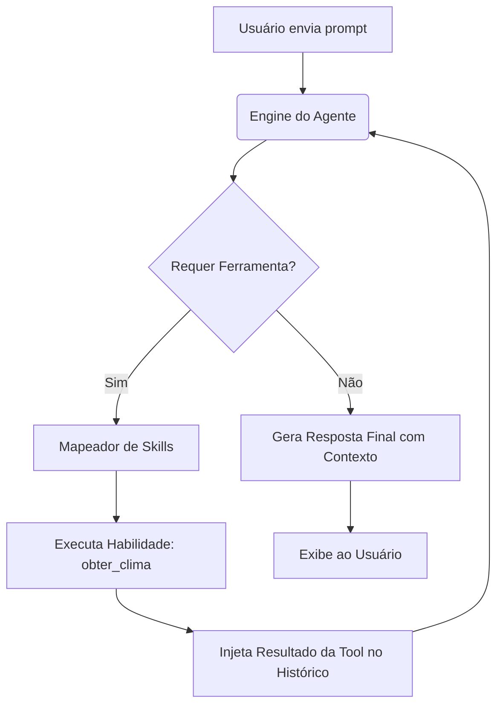

# 🌤️ Weather AI Agent

[](https://www.python.org/)
[](https://github.com/astral-sh/uv)
[](https://groq.com/)
[](https://opensource.org/licenses/MIT)

Um agente de Inteligência Artificial especializado em meteorologia, projetado com uma arquitetura leve, extensível e de baixíssima latência. O agente utiliza a orquestração inteligente de chamadas de ferramentas (*Function Calling*) nativas do **Groq Cloud** para buscar e interpretar dados meteorológicos em tempo real.

---

## ✨ Funcionalidades Principais

*   🤖 **Orquestração Autônoma de Decisões**: O agente decide de forma inteligente quando deve responder diretamente ou quando precisa invocar uma ferramenta externa para coletar informações precisas de clima.
*   🛠️ **Arquitetura de Skills Modulares**: Um sistema de registro simplificado (`skills/`) que permite estender as capacidades do agente com pouquíssimas linhas de código.
*   🧠 **Memória de Conversação Integrada**: Mantém o contexto completo do diálogo, permitindo que você faça perguntas subsequentes ("E como está o clima lá?", "Levo um guarda-chuva?").
*   ⚡ **Inferência de Ultra Baixa Latência**: Integração nativa com a API do **Groq**, possibilitando respostas em milissegundos com modelos de linguagem de ponta.
*   📦 **Gerenciamento Moderno de Pacotes**: Utiliza o gerenciador `uv` da Astral, garantindo ambientes virtuais e dependências instaladas de forma extremamente veloz e segura.

---

## 🏗️ Arquitetura do Sistema

O fluxo do agente é estruturado sob o conceito de **Loop de Reação** (*Reasoning and Acting - ReAct*), onde o LLM analisa a pergunta do usuário e decide o próximo passo:



### Estrutura de Pastas

```text
├── agent/
│   ├── __init__.py
│   └── engine.py          # Motor de execução do agente (orquestração do LLM & Ferramentas)
├── skills/
│   ├── __init__.py
│   ├── registry.py        # Centralizador e exportador de Schemas e Funções
│   └── weather.py         # Lógica da skill de meteorologia (schemas e chamadas de API)
├── .env                   # Variáveis de ambiente (Chaves de API)
├── main.py                # Ponto de entrada (CLI Loop interativo)
├── pyproject.toml         # Configuração de dependências do Python
└── README.md              # Documentação do projeto
```

---

## 🚀 Começando

Siga as instruções abaixo para configurar e rodar o projeto localmente.

### Pré-requisitos

*   **Python 3.13** ou superior instalado.
*   **uv** instalado em sua máquina. Se ainda não possui o `uv`, instale-o rapidamente via curl:
    ```bash
    curl -LsSf https://astral.sh/uv/install.sh | sh
    ```

### 📦 Instalação

1. Clone o repositório em sua máquina:
   ```bash
   git clone https://github.com/nbdnn/weather-ai-agent.git
   cd projetos_ai
   ```

2. Crie e sincronize o ambiente virtual com as dependências do projeto:
   ```bash
   uv sync
   ```

### ⚙️ Configuração

Crie um arquivo `.env` na raiz do projeto (ou utilize o existente) e configure as seguintes chaves de API:

```env
GROQ_API_KEY="sua_chave_de_api_do_groq_aqui"
MODEL="openai/gpt-oss-120b" # Ou outro modelo de sua preferência no Groq
```

---

## 🎮 Executando o Agente

Com o ambiente virtual configurado, você pode iniciar o loop de conversação interativa no terminal executando:

```bash
uv run main.py
```

### Exemplo de Interação

```text
--- Agente de IA Iniciado (Com Memória) ---

Você: Como está o tempo em São Paulo hoje?
Agente: Em São Paulo, o clima está atualmente com 25°C e ensolarado. Ótimo dia para atividades ao ar livre!

Você: E em Curitiba?
Agente: Em Curitiba, a temperatura está em 12°C e o clima está chuvoso. Recomendo levar um guarda-chuva se for sair!

Você: Qual das duas cidades está mais quente?
Agente: São Paulo está consideravelmente mais quente, com 25°C, comparado aos 12°C e chuva de Curitiba.
```

---

## 🛠️ Como Estender as Capacidades do Agente (Skills)

Adicionar novas capacidades para o agente é extremamente simples. O projeto usa uma estrutura declarativa:

### 1. Crie uma nova Skill
Escreva uma nova função de negócio e seu respectivo Schema de Function Calling JSON. Por exemplo, em um novo arquivo `skills/location.py`:

```python
# Exemplo de nova habilidade
LOCATION_SKILL_SCHEMA = {
    "type": "function",
    "function": {
        "name": "obter_fuso_horario",
        "description": "Obtém o fuso horário oficial de uma cidade.",
        "parameters": {
            "type": "object",
            "properties": {
                "cidade": {"type": "string"}
            },
            "required": ["cidade"]
        }
    }
}

def obter_fuso_horario(cidade: str) -> str:
    # Lógica de negócio
    return "GMT-3"
```

### 2. Registre a Skill
Adicione o Schema e a função de mapeamento no arquivo `skills/registry.py`:

```python
from skills.weather import WEATHER_SKILL_SCHEMA, obter_clima
from skills.location import LOCATION_SKILL_SCHEMA, obter_fuso_horario

ALL_TOOLS_SCHEMA = [
    WEATHER_SKILL_SCHEMA,
    LOCATION_SKILL_SCHEMA # Nova ferramenta para o LLM conhecer
]

TOOL_MAPPING = {
    "obter_clima": obter_clima,
    "obter_fuso_horario": obter_fuso_horario # Mapeamento de execução
}
```

O `Agente` automaticamente importará a nova skill, mapeará seu uso nas chamadas e saberá quando invocá-la!

---

## 🗺️ Roadmap de Desenvolvimento

- [ ] **Integração com API Real**: Substituir os dados estáticos (*mock*) por uma conexão viva com serviços como [OpenWeatherMap API](https://openweathermap.org/api) ou [HG Brasil Clima](https://hgbrasil.com/status/clima).
- [ ] **Suporte a Alertas Geográficos**: Notificar alertas climáticos severos usando a localização aproximada do IP ou do input do usuário.
- [ ] **Interface Amigável (Web/Chatbot)**: Implementar uma interface web minimalista usando Streamlit/Vite, ou integrar o agente como um Bot do Telegram.
- [ ] **Suporte a Buscas Complexas**: Adicionar suporte a gráficos de temperatura históricos e previsões estendidas de 7 dias.

---

## 📝 Licença

Este projeto é distribuído sob a licença MIT. Veja o arquivo `LICENSE` (se disponível) para obter mais detalhes.

---
*Desenvolvido com carinho para ser seu assistente meteorológico inteligente de bolso! 🌤️🤖*
